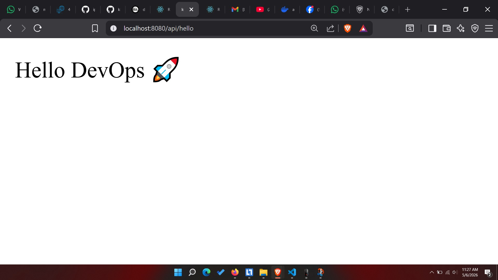
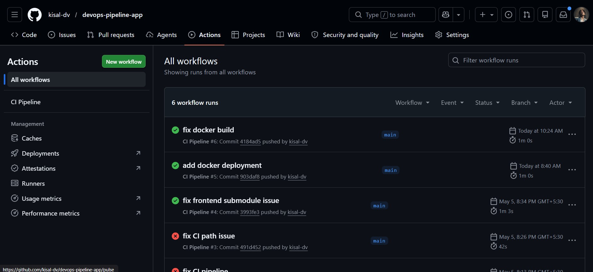
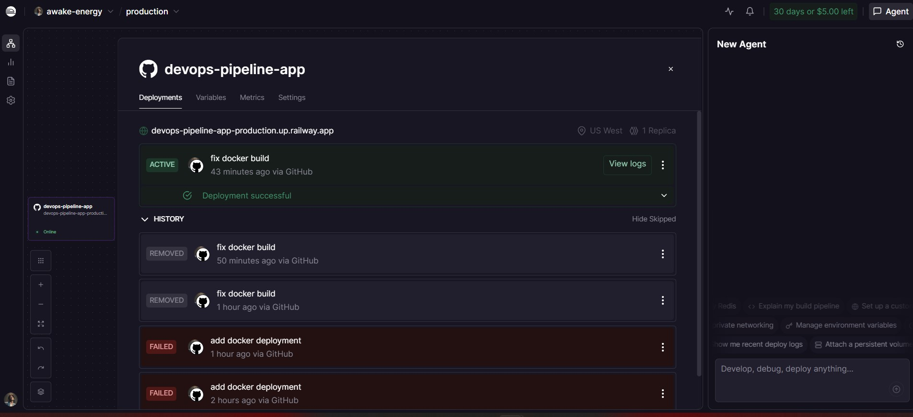

# 🚀 DevOps Pipeline App


A full-stack DevOps project built using Spring Boot, React, Docker, GitHub Actions, and Railway deployment.

---

# 🌍 Live Demo

🔗 https://devops-pipeline-app-production.up.railway.app/api/hello

---

# 📌 Project Overview

This project demonstrates a complete DevOps workflow by integrating:

- Frontend application using React
- Backend REST API using Spring Boot
- CI/CD pipeline using GitHub Actions
- Docker containerization
- Cloud deployment using Railway

The application automatically builds and deploys through CI/CD workflows after code changes are pushed to GitHub.

---

# ⚙️ Tech Stack

## Frontend
- React
- JavaScript
- CSS

## Backend
- Spring Boot
- Java
- Maven

## DevOps / Deployment
- Docker
- GitHub Actions
- Railway

---

# 🔥 Features

✅ REST API integration  
✅ Dockerized backend  
✅ Automated CI/CD pipeline  
✅ GitHub Actions workflow  
✅ Cloud deployment  
✅ Public live API endpoint  
✅ Full-stack architecture  
✅ Containerized deployment  

---

# 🏗️ Architecture

```text
React Frontend
       ↓
Spring Boot REST API
       ↓
Docker Container
       ↓
Railway Cloud Deployment
```

---

# 🚀 API Endpoint

## Test Endpoint

GET:

```bash
/api/hello
```

## Live Endpoint

```bash
https://devops-pipeline-app-production.up.railway.app/api/hello
```

## Example Response

```text
Hello DevOps 🚀
```

---

# 🔄 CI/CD Workflow

1. Push code to GitHub
2. GitHub Actions automatically starts
3. Frontend and backend build process runs
4. Docker image is created
5. Railway deploys the latest version automatically

---

# 💻 Local Setup

## Clone Repository

```bash
git clone https://github.com/kisal-dv/devops-pipeline-app.git
```

---

## Backend Setup

```bash
cd backend
mvn spring-boot:run
```

Backend runs on:

```text
http://localhost:8080
```

---

## Frontend Setup

```bash
cd frontend
npm install
npm start
```

Frontend runs on:

```text
http://localhost:3000
```

---

# 🛠️ Challenges & Solutions

## 1. GitHub Actions could not detect frontend package.json

### Issue
The CI pipeline failed because the frontend folder was accidentally added as a separate Git submodule.

### Solution
Removed the nested `.git` repository inside the frontend folder and re-added it correctly to the main repository.

---

## 2. Maven dependency download failures

### Issue
Spring Boot dependencies failed to download during Maven build due to interrupted package downloads.

### Solution
Cleaned Maven cache and rebuilt the project successfully using Maven commands.

---

## 3. React frontend API fetch failed

### Issue
Frontend could not connect to backend API because the backend server was not running properly.

### Solution
Verified backend server execution and corrected API endpoint configuration.

---

## 4. Docker deployment build failed

### Issue
Docker deployment failed because the application JAR file was not available during image build.

### Solution
Implemented a multi-stage Docker build process using Maven and Eclipse Temurin images.

---

## 5. Railway deployment startup crash

### Issue
Deployment container crashed because Railway start commands conflicted with Docker CMD instructions.

### Solution
Removed custom Railway start commands and allowed Docker to manage container startup.

---

## 6. CI/CD pipeline path issues

### Issue
GitHub Actions could not locate frontend build files due to incorrect workflow paths.

### Solution
Updated workflow configuration and corrected project directory structure.

---

# 📖 What I Learned

- Setting up CI/CD pipelines using GitHub Actions
- Docker containerization basics
- Cloud deployment workflows
- Debugging deployment and build issues
- Managing frontend and backend integration
- Spring Boot deployment practices
- DevOps troubleshooting workflow
- Railway cloud deployment
- Multi-stage Docker builds

---

# 📷 Screenshots

## Frontend UI



---

## GitHub Actions Pipeline



---

## Railway Deployment



---

# 📚 Learning Outcomes

- CI/CD pipeline setup
- Docker containerization
- Spring Boot deployment
- GitHub Actions automation
- Cloud deployment workflow
- DevOps debugging and troubleshooting
- Full-stack deployment understanding

---

# 🔮 Future Improvements

- Kubernetes deployment
- Nginx reverse proxy
- Monitoring with Prometheus/Grafana
- Database integration
- Full frontend deployment
- HTTPS custom domain
- Automated testing pipeline

---

# 👨‍💻 Author

## Kisal Angira

Software Engineering Student  
Focused on Full-Stack Development and DevOps Engineering

GitHub:
https://github.com/kisal-dv